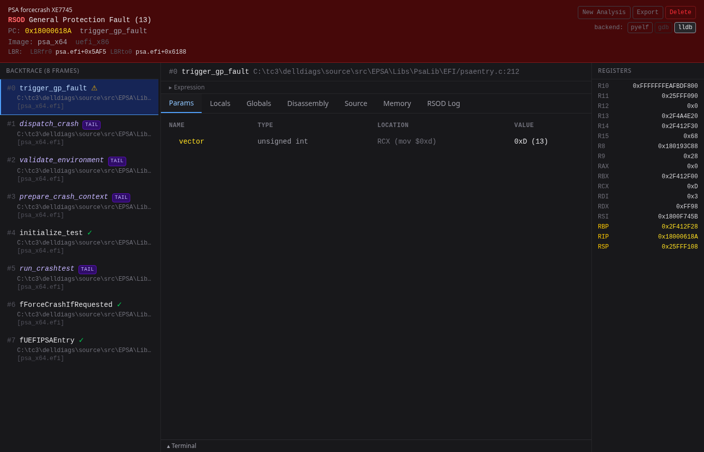
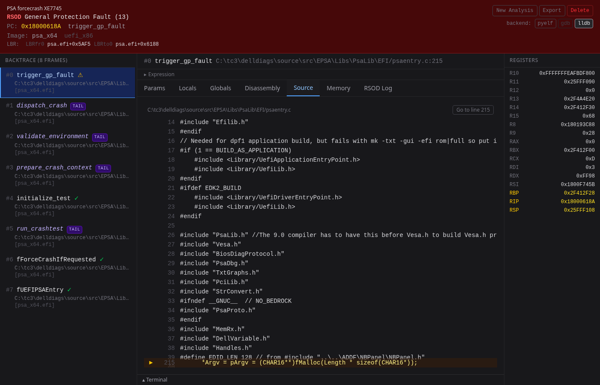
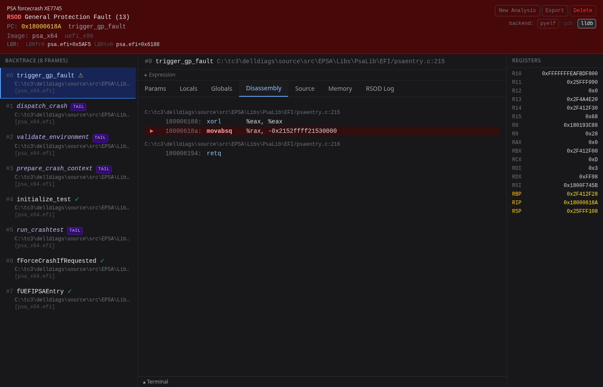
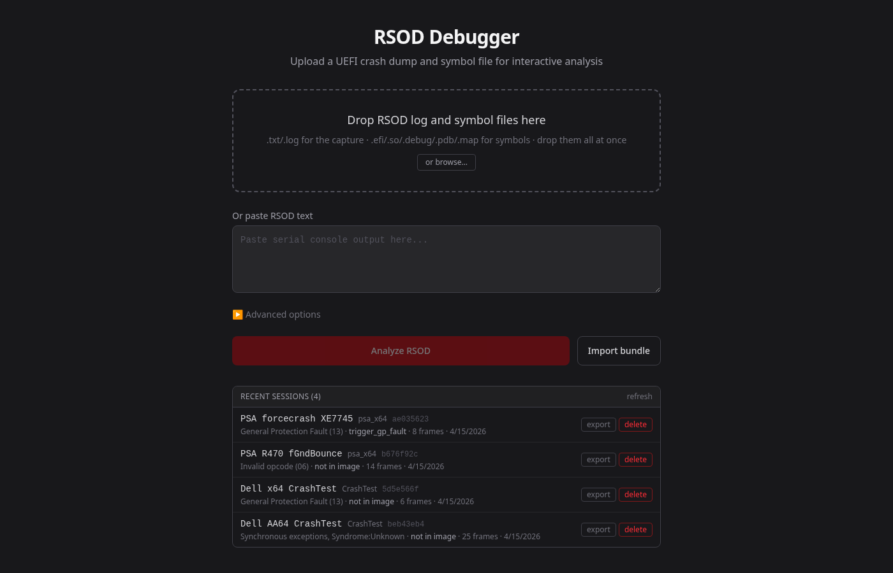

# rsod-decode

Interactive UEFI **R**ed **S**creen **O**f **D**eath crash dump
debugger. Resolves raw addresses in serial-console crash captures
to function names, source files, parameters, and locals via DWARF
or PE+PDB. Ships as a single `rsod` binary with `decode` (text
report), `serve` (web UI), and `history` subcommands, plus a
self-contained `rsod.pyzw` zipapp.

Supports x86-64 and ARM64; auto-detects EDK2 ARM64, Dell UEFI
ARM64, Dell UEFI x86-64, and MSVC EPSA x86-64 (with or without
PDB) formats.

---

## At a glance

**Web UI** — drop your RSOD log + symbol files, get a clickable
backtrace, per-frame parameters/locals, disassembly, source
context, and an in-browser LLDB/GDB terminal:



**Source tab** — full file with the crash line highlighted and
a "Go to line" reset button:



**Disassembly tab** — instructions around the faulting PC with
inline source-line annotations:



**Upload + history** — drop files into one zone, sessions persist
across restarts, dedup by content hash, exportable as `.rsod.zip`
bundles for cross-team sharing:



---

## Quick start

```bash
pip install -e ".[gdb,dev]"

# Web UI — opens a browser tab
rsod serve

# Pre-load a crash on startup
rsod serve rsod.txt app.efi.so

# Text report to stdout
rsod decode rsod.txt app.efi.so -v

# List sessions you've already analyzed
rsod history

# Replay a stored session
rsod decode --session ab12cd34
```

The standalone zipapp ships the same subcommands:

```bash
python rsod.pyzw serve  rsod.txt app.efi.so
python rsod.pyzw decode rsod.txt app.efi.so -v
python rsod.pyzw history
```

---

## Web UI (`rsod serve`)

Starts a local Flask server, opens your default browser, and lets
you drop any combination of RSOD log + symbol files in one action.

```bash
rsod serve                                 # upload form at localhost:5000
rsod serve rsod.txt app.efi.so             # pre-load a session on startup
rsod serve rsod.txt app.efi -s app.pdb     # MSVC PE+PDB crash
rsod serve --port 9090 --no-browser        # custom port, skip browser open
rsod serve --source-path ~/src/myproject   # extra source tree for source view
```

### Features

- **Clickable backtrace** with call-verification markers
  (`[verified]` / `[stale?]`) and inline expansion
- **Per-frame parameters and locals** with PC-accurate register/
  stack location tracking; struct/pointer fields are expandable
- **Memory hex-dump viewer** with region labels (stack, .text, etc.)
- **Disassembly** around the faulting PC with source-line headers
- **Full-file source view** that auto-scrolls to the crash line;
  scroll freely, use **"Go to line N"** to reset
- **Register panel** with symbol annotations and crash-vs-CFI-unwound
  highlighting
- **Three DWARF backends** — pyelftools (always), GDB/MI, system
  LLDB (richer; PE+PDB minidumps + callsite-arg reconstruction)
- **In-browser LLDB and GDB terminals** sharing the session's
  debugger state
- **Expression evaluation** via the LLDB/GDB backends
- **Persistent session history** (see below)

### Persistent session store

Uploaded sessions survive `rsod serve` restarts. Every upload writes
to a SQLite store at `~/.rsod-debug/sessions.db` plus a per-session
files directory under `~/.rsod-debug/files/<id>/`. The upload page
shows a "Recent sessions" list below the upload zone — click any row
to reopen the crash.

Session IDs are 16-char sha256 prefixes over the input bytes, so
re-uploading identical content deduplicates and Alice's id matches
Bob's id for the same crash. **Sessions are never auto-deleted**;
the only way to remove one is the explicit Delete button (in the
crash banner or per-row in history).

Override the data directory with `RSOD_DATA_DIR=...` for CI or
project-isolated history.

### Cross-machine sharing — export / import bundles

Click **Export** in the crash banner (or on a history row) to
download an `.rsod.zip` bundle:

```
crash-2026-04-15-ab12cd34.rsod.zip
```

The bundle contains the original RSOD text, the symbol files, and
a small `metadata.json` manifest. Send it to a teammate; they click
**Import bundle** on their upload page and drop straight into the
imported session — no out-of-band symbol file transfer needed.

Because session IDs are content hashes, the imported session lands
on the same `ab12cd34` id Alice's machine has. A
`#session/ab12cd34` permalink resolves to the same crash on any
install that has imported the bundle.

### Friendly session names

Click the session name above the crash banner (or the **Name**
button if unnamed) to set a friendly alias visible in history and
the banner. Useful for "R470 fGndBounce" vs `ae035623cff5c98a`.

---

## CLI (`rsod decode`)

Text report for a single crash. Default output is
`<log>_decode.txt` (override with `-o`); `--session` writes to
stdout.

```bash
# From files (also persists to history)
rsod decode rsod.txt app.efi.so
rsod decode rsod.txt app.efi.so -v                  # adds params/locals/disasm/source
rsod decode rsod.txt app.efi.so --tag v1.0.3        # source from a git ref
rsod decode rsod.txt app.efi.so --base 5948A000     # base address override
rsod decode rsod.txt app.efi.so --name "R470 crash" # friendly name in history

# From a previously persisted session
rsod decode --session ae035623                      # 8-char prefix is enough
rsod decode --session ae035623 -v                   # with params/disasm/source
```

### `rsod history`

Compact table of all persisted sessions, newest first:

```
ID          NAME                  IMAGE           EXCEPTION                 SYMBOL             FR   AGE
-------------------------------------------------------------------------------------------------------
ae035623    PSA forcecrash XE77…  psa_x64         General Protection Faul…  trigger_gp_fault    8    1m
b676f92c    PSA R470 fGndBounce   psa_x64         Invalid opcode (06)       not in image       14    1m
5d5e566f    Dell x64 CrashTest    CrashTest       General Protection Faul…  not in image        6    1m
```

`--json` for machine-readable output. `-n N` to limit row count.

### Options

| Option | Description |
|--------|-------------|
| `-o FILE` | Output file path (default: `<log>_decode.txt`, stdout for `--session`) |
| `-v, --verbose` | Show disassembly, source context, and parameters |
| `-s FILE` | Additional symbol file for multi-module traces (repeatable) |
| `--base HEX` | Override image base address (hex, e.g. `5948A000`) |
| `--source-path PATH` | Source tree to search (repeatable; auto-detected repo is fallback) |
| `--tag TAG` | Git tag for source context (reads source at that revision) |
| `--commit HASH` | Git commit hash for source context |
| `--session ID` | Replay a persisted session by id (full or 4+ char prefix) |
| `--name TEXT` | Friendly display name for the session (visible in history) |
| `--backend NAME` | Force a DWARF backend (`auto`, `lldb`, `gdb`, `pyelftools`) |

---

## Capturing an RSOD

Connect to the server's BMC/iDRAC via SSH, then use the serial
console:

```
racadm>> console com2
```

When the RSOD appears, copy the full text from PuTTY (or save the
PuTTY session log). The capture should include the register dump
and stack dump.

---

## Symbol files

| Source | Format | Functions | Source lines | Inlines | Param names | Locals |
|--------|--------|-----------|-------------|---------|------------|--------|
| MSVC `.map` | Text | yes | no | no | no | no |
| MSVC `.efi` + `.pdb` | PE + PDB (LLDB) | yes | yes | yes | yes | yes |
| GCC `.so` / unstripped `.efi` | ELF + DWARF | yes (demangled) | yes | yes | yes | yes |

The tool auto-detects format by magic bytes. The `.efi` produced by
`objcopy` is typically **stripped** — use the `.so` (or unstripped
`.efi`) for ELF builds.

For MSVC builds, drop the `.efi` + `.pdb` together for full
parameter/local visibility; the PDB drives an LLDB minidump session
behind the scenes.

---

## Supported RSOD formats

| Format | Detected by | Architecture |
|--------|-------------|--------------|
| UEFI BIOS x86 | `AX=`, `-->RIP` | x86-64 |
| UEFI BIOS ARM64 | `X0=`, `-->PC`, `s00..sNN` | ARM64 |
| EDK2 ARM64 | `Synchronous Exception`, `X0` | ARM64 |
| EDK2 x64 | `!!!! X64 Exception`, `RIP  -` | x86-64 |

---

## Requirements

Python 3.10+. Backend-specific:

| Package | Purpose | Required |
|---------|---------|----------|
| `pyelftools` | ELF + DWARF baseline | yes |
| `capstone` | x86-64 / ARM64 disassembly | yes |
| `cxxfilt` | C++ name demangling | yes |
| `flask` + `flask-sock` | web UI + WS terminals | for `serve` |
| `pygdbmi` | GDB/MI cross-check backend | optional |
| system LLDB | richer ELF + PE+PDB analysis | optional |

System LLDB is auto-detected from `/usr/lib64/python3.*/site-packages/lldb`
(Fedora/RHEL) or equivalent on other distros. The tool falls back
cleanly when it's absent — pyelftools handles ELF, GDB handles
ELF cross-check, PE+PDB sessions degrade to map-file-only analysis.

---

## Building from source

```bash
# Install editable + dev deps
pip install -e ".[gdb,dev]"

# Build the React frontend
cd frontend && npm install && npm run build && cd ..

# Package as a single zipapp
python build_pyz.py
# → rsod.pyzw (~2.6 MB, includes Flask, capstone, frontend dist)
```

Optional: `pip install -e ".[browser]" && python -m playwright install chromium`
for the Playwright-driven browser regression tests.

---

## Architecture

See [DESIGN.md](DESIGN.md) for the full backend architecture
(SQLite session store, ingest pipeline, three DWARF backends,
schema migrations, frontend persistence contract, etc.).
